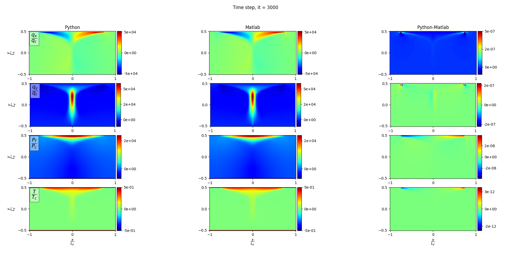
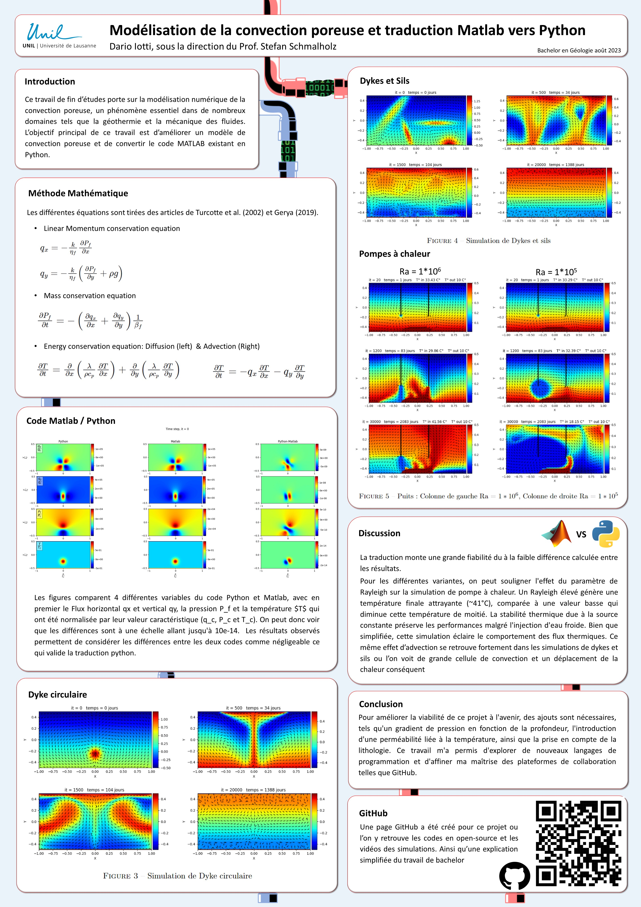

# Numerical modeling of porous convection and translating MATLAB to Python

# Content

* [Objectives](#objectives)
* [About this repository](#about-this-repository)
* [Code description](#code-description)
* [Results](#Results)

# Objectives
This contribution presents a translation work from a Matlab numerical code to Python and to represent some simulations of porous convection.

# About this repository
In this repository you can find:
- Python code [Python_porous convection.py](Codes/Traduction_python.py)
- Matlab code [Matlab_porous convection.m](Codes/master_2020_task22_porous_convection_v2.m)
- The code that compares the 2 results [Python_Matlab_Comparator.py](benchmark_python_matlab_singletimestep.py)

# Code description
* [Linear momentum conservation equation](#Linear-momentum-conservation-equation)
* [Mass conservation equatio](#Mass-conservation-equation)
* [Energy conservation equation](#Energy-conservation)

## Linear Momentum conservation equation
### Darcy velocity
In this first equation, we calculate the fluxes $qx$ and $qy$, which describe the flow rate through a porous environment, linking the derivative of the fluid pressure $P_f$ as a function of its position $x$ or $y$ to the compressibility $k$ dependent on the fluid viscosity $\eta_f$. We also include the density $\rho$ and the gravitational acceleration $g$ for the vertical flux $qy". This will allow us to determine our advection subsequently.

$q_x = -\frac{k}{\eta_f}\frac{\partial P_f}{\partial x}$

$q_y = -\frac{k}{\eta_f} \left( \frac{\partial P_f}{\partial y} + \rho g \right)$

```md
qx[1:-1, 1:-1] = -k_etaf*(np.diff(Pf[:, 1:-1], axis=0)/dx)
qy[1:-1, 1:-1] = -k_etaf*(np.diff(Pf[1:-1, :], axis=1)/dy 
+ (rho_g[1:-1, :-1] + rho_g[1:-1, 1:])/2)
```

⤴️ [_back to content_](#content)

## Mass conservation equation
### Compressible mass conservation equation
The pressure changes based on the flux deltas $qx$ and $qy$, which correspond to the inflow and outflow of fluid that will alter the pressure within my space. The higher the compressibility $\beta_f$ is, the less the changes in flux will affect the pressure.

$\frac{\partial P_f}{\partial t} = - \left( \frac{\partial q_x}{\partial x} + \frac{\partial q_y}{\partial y} \right) \frac{1}{\beta_f}$

```md
dPfdt   = -(np.diff(qx, axis=0)/dx + np.diff(qy, axis=1)/dy)/betaf
```

⤴️ [_back to content_](#content)

###  Continuity equation
Evolution of pressure over time.

$\Delta P_f = \frac{\Delta P_f}{\Delta t} \Delta t
P_f^{new} = P_f^{old} + \Delta P_f$

$\frac{\partial P_f}{\partial t} \approx \frac{\Delta P_f}{\Delta t} = \frac{P_f^{new} - P_f^{old}}{\Delta t}$

```md
deltaPf = dt*dPfdt
Pf      = Pf + deltaPf 
max_delta_Pf.append(np.max(np.abs(deltaPf)))
if max_delta_Pf[len(max_delta_Pf)-1]/np.max(np.abs(Pf)) < tol:
    break
```

⤴️ [_back to content_](#content)

## Energy conservation
### Heat diffusion equation

Diffusion corresponds to the transfer of heat without the movement of mass, thus not directly related to $qx$ and $qy$.

$\frac{\partial T}{\partial t} = \frac{\partial}{\partial x} \left( \frac{\lambda}{\rho c_p} \frac{\partial T}{\partial x} \right) + \frac{\partial}{\partial y} \left( \frac{\lambda}{\rho c_p} \frac{\partial T}{\partial y} \right)$

$T_f^{new} = T_f^{old} + \frac{\Delta T}{\Delta t} \Delta t$

$\frac{\partial T}{\partial t} \approx \frac{\Delta T}{\Delta t} = \frac{T^{new} - T^{old}}{\Delta t}$

```md
dTdt = np.diff(lam_rhoCp * np.diff(T[:, 1:-1], axis=0) / dx, axis=0) / dx \
+ np.diff(lam_rhoCp * np.diff(T[1:-1, :], axis=1) / dy, axis=1) / dy
T[1:-1, 1:-1] += dTdt * dt
```

⤴️ [_back to content_](#content)

### Heat Advection equation

Advection serves to ascertain the heat's propagation within our system. The Rayleigh number primarily determines which of the two, advection or diffusion, is expected to be dominant.

$\frac{\partial T}{\partial t} = - q_x \frac{\partial T}{\partial x} - q_y \frac{\partial T}{\partial y}$

$T_f^{new} = T_f^{old} + \frac{\Delta T}{\Delta t} \Delta t$

```md
T[:, 1:] -= dt * np.maximum(0, qy[:,1:-1]) * np.diff(T, axis=1) / dy
T[:,:-1] -= dt * np.minimum(0, qy[:,1:-1]) * np.diff(T, axis=1) / dy
T[1:,:]  -= dt * np.maximum(0, qx[1:-1,:]) * np.diff(T, axis=0) / dx
T[:-1,:] -= dt * np.minimum(0, qx[1:-1,:]) * np.diff(T, axis=0) / dx
```

⤴️ [_back to content_](#content)
# Results
* [Difference between Python and Matlab code](Codes/TB_Dario_A.py)
* [Dykes and Syls Code](Codes/TB_Dario_B.py)
* [Geothermal well](Codes/TB_Dario_D.py)

## Difference between Python and Matlab code

<div style="display: flex;">
    
</div>

Figures compare four different variables from the Python and Matlab code. The curves correspond to the horizontal flux $qx$ and vertical flux $qy$, fluid pressure $P_f$, and temperature $T$, which have been normalized by their characteristic values ($q_c$, $P_c$, and $T_c$). Consequently, differences are observed on a scale of up to 10e-14. Thus, they can be considered negligible, highlighting the accuracy of the Matlab code translation.

## Different situation
### Dykes and Syls

<div style="display: flex;">
     | 
</div>

### Geothermal well with different Rayleigh
* Ra = 1e6 (left) 
* Ra = 1e5 (right)
<div style="display: flex;">
     | 
</div>

⤴️ [_back to code description_](#code-description)

# Poster Scientifique
<div style="display: flex;">
    
</div>
